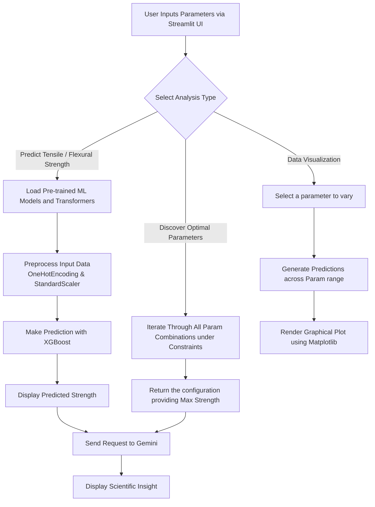

# Material Strength Prediction Suite 🔬

The **Material Strength Prediction Suite** is a comprehensive tool built using Streamlit that predicts the Tensile and Flexural strengths of 3D-printed composite materials. It integrates Machine Learning models (trained using XGBoost) and is enhanced by Google's Gemini AI to provide scientific insights based on your material configurations.

## 🌟 Features

- **Tensile Strength Prediction**: Predict the tensile strength based on specific material parameters (orientation, infill pattern, layer thickness, etc.).
- **Flexural Strength Prediction**: Predict the flexural strength via an intuitive interface.
- **AI Insights via Gemini**: After making a prediction, the app fetches actionable insights using the Gemini AI, giving microscopic mechanics and scientific reasoning behind the generated strength values.
- **Optimization**: Discover the optimal parameters to yield the maximum achievable Tensile and Flexural strength within realistic constraints (e.g., MWCNT and Graphene individually not exceeding 1.5%).
- **Interactive Graph Analysis**: Plot the predicted strength by varying a single parameter while holding others fixed, helping in parameter sensitivity analysis.

## 🛠️ Technology Stack

- **Frontend**: Streamlit
- **Machine Learning**: Scikit-Learn, XGBoost, Pandas, Numpy
- **Data Visualization**: Matplotlib, Seaborn
- **Generative AI**: Google Gemini API (via HTTP requests)
- **Environment Management**: Python-dotenv

## ⚙️ Installation & Setup

1. **Clone the repository** (if you haven't already):
   ```bash
   git clone <repository_url>
   cd Material-Strength-main/Material-Strength-main
   ```

2. **Set up a Virtual Environment** (Optional but recommended):
   ```bash
   python -m venv venv
   # Windows
   .\venv\Scripts\activate
   # macOS/Linux
   source venv/bin/activate
   ```

3. **Install Dependencies**:
   ```bash
   pip install -r requirements.txt
   ```

4. **Add your Gemini API Key**:
   Create a `.env` file in the root directory (where `combined_app.py` is located) and add your Gemini API key:
   ```env
   GEMINI_API_KEY=your_gemini_api_key_here
   ```

5. **Run the Application**:
   ```bash
   streamlit run combined_app.py
   ```

## 🧠 Model Training

The `train.py` script demonstrates how the underlying logic was built. The dataset (`train1.csv`) consists of material combinations including:
- **Categorical Columns**: `orientation`, `infill_pattern`
- **Numerical Columns**: `layer_thick`, `infill_density`, `mwcnt`, `graphene`
- **Targets**: `tensile_str`, `flexural_str`

The features are preprocessed (OneHotEncoding for categorical, StandardScaler for numerical) and trained using an ensemble tree algorithm (XGBoost) through RandomizedSearchCV for hyperparameter tuning. The trained parameters are exported as `.pkl` objects housed inside the `Models/` directory.

## 📊 Application Flowchart

Here is a visual representation of the application's overall workflow:



## 📈 File Structure Overview

- `combined_app.py`: The Main Streamlit application.
- `train.py`: Script used for exploratory data analysis, data scaling, and training the XGBoost models.
- `train1.csv`: The core dataset containing testing entries for various strengths.
- `Models/`: Directory holding the pickled trained model artifacts (`Flex_orientation.pkl`, `Tens_orientation.pkl`).
- `.env`: Stores secret configurations, like `GEMINI_API_KEY`. (Ensure this file is ignored in version control via `.gitignore`).
