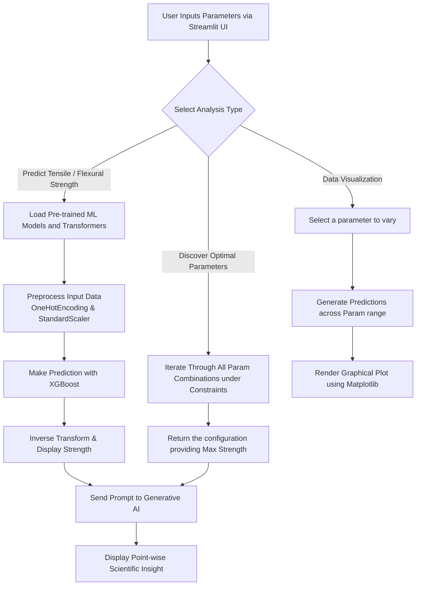

# Material Strength Prediction Suite 🔬

The **Material Strength Prediction Suite** is a comprehensive tool built using Streamlit that predicts the Tensile and Flexural strengths of 3D-printed composite materials. It integrates Machine Learning models (trained using XGBoost) and is enhanced by Generative AI to provide point-wise scientific insights based on your material configurations.

## 🌟 How the Project Works

The application provides an intuitive end-to-end workflow for material scientists and 3D printing enthusiasts:
1. **User Input**: Users enter physical parameters of a 3D print (Orientation, Infill Pattern, Layer Thickness, Infill Density, MWCNT %, and Graphene %) into the Streamlit interface.
2. **Data Transformation**: The inputs are packaged into a dataframe and processed using the exact same `OneHotEncoder` and `StandardScaler` fitted during the model's training phase.
3. **Model Inference**: The processed data is fed into a pre-trained XGBoost regressor, which calculates the predicted strength in MPa. The prediction is then inverse-scaled back to a readable, real-world value.
4. **AI Scientific Insight**: The predicted strength and input parameters are sent as a structured prompt to Google's Gemini AI (with a Grok/Groq API fallback in case of server issues). The AI acts as a materials science expert, returning a point-wise breakdown of the microscopic mechanics responsible for the predicted strength.

## 🧠 Model Training (`train.py`)

The ML backbone was established using the `train.py` script. The model was trained entirely on the `train1.csv` dataset.

### 1. Data Preprocessing
- **Categorical Data**: `orientation` and `infill_pattern` are converted into a sparse matrix using `OneHotEncoder`.
- **Numerical Data**: `layer_thick`, `infill_density`, `mwcnt`, and `graphene` alongside the target variable (`tensile_str` or `flexural_str`) are normalized using `StandardScaler` to ensure all features contribute proportionately.

### 2. Data Splitting
The normalized data is split into three sets to ensure proper evaluation without data leakage:
- **Training Set**: 80%
- **Validation Set**: 10%
- **Test Set**: 10%

### 3. Training & Hyperparameter Tuning
We utilize the **XGBoost Regressor** (`xgb.XGBRegressor`) with an objective of `reg:squarederror`. To find the absolute best version of the model, we use `RandomizedSearchCV` from `scikit-learn`:
- Explores a vast grid of hyperparameters: `n_estimators` (up to 1000), `learning_rate`, `max_depth`, `min_child_weight`, `base_score`, and `early_stopping_rounds`.
- Evaluates models using **5-Fold Cross-Validation** over 50 iterations.
- Optimizes for the lowest Negative Mean Absolute Error (MAE).

### 4. Serialization
Once the optimal model configuration is discovered, the best estimator, the fitted scalers, and encoders are serialized (pickled) and saved to the `Models/` directory for deployment.

## 🤖 Inference & AI Explanations

### Inference Under the Hood
During inference (`combined_app.py`), the app relies heavily on the cached `load_model_and_preprocessors()` functions.
When a user clicks "Predict":
1. A single-row DataFrame is created from the Streamlit widgets.
2. The `OneHotEncoder.transform()` handles the text categories.
3. `StandardScaler.transform()` normalizes the input to match the feature space the model was trained on.
4. `model.predict()` executes the XGBoost tree traversal.
5. `scaler_y.inverse_transform()` converts the normalized prediction back to Megapascals (MPa).

### AI Reasoning Engine
The application doesn't stop at numbers. It dynamically crafts a prompt embedding the exact input parameters and the XGBoost prediction. 
- It asks the LLM (Gemini/Groq) to provide **3-4 concise points** of reasoning.
- It strictly enforces the usage of physical units (e.g., mm, %, MPa).
- This results in the user receiving actionable context—such as how higher infill density promotes load distribution, or how MWCNT weight percentages affect matrix bonding at a microscopic level.

## 🛠️ Technology Stack

- **Frontend**: Streamlit
- **Machine Learning**: Scikit-Learn, XGBoost, Pandas, Numpy
- **Data Visualization**: Matplotlib
- **Generative AI**: Google Gemini API (via HTTP requests) with Groq API Fallback
- **Environment Management**: Python-dotenv

## ⚙️ Installation & Setup

1. **Clone the repository**:
   ```bash
   git clone <repository_url>
   cd Material-Strength-main/Material-Strength-main
   ```

2. **Set up a Virtual Environment**:
   ```bash
   python -m venv venv
   # Windows
   .\venv\Scripts\activate
   # macOS/Linux
   source venv/bin/activate
   ```

3. **Install Dependencies**:
   ```bash
   pip install -r requirements.txt
   ```

4. **Add your API Keys**:
   Create a `.env` file in the root directory and add your API keys:
   ```env
   GEMINI_API_KEY=your_gemini_api_key_here
   GROK_API_KEY=your_groq_api_key_here
   ```

5. **Run the Application**:
   ```bash
   streamlit run combined_app.py
   ```

## 📊 Application Flowchart



## 📈 File Structure Overview

- `combined_app.py`: The Main Streamlit application containing the UI, inference logic, and API calls.
- `train.py`: Script used for exploratory data analysis, data scaling, hyperparameter tuning, and training the XGBoost models.
- `train1.csv`: The core dataset containing testing entries for various strengths.
- `Models/`: Directory holding the pickled trained model artifacts (`Flex_orientation.pkl`, `Tens_orientation.pkl`).
- `.env`: Stores secret configurations, like API keys.
